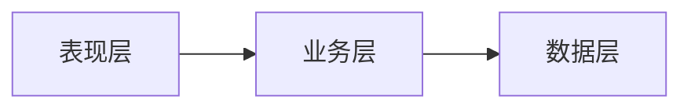
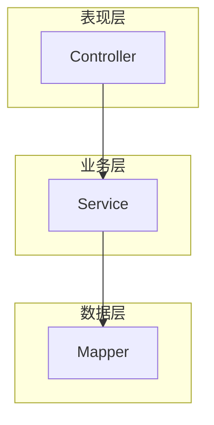

# 已知陷阱与规避

子代理生成文档时最常犯的错误。每个陷阱用 ❌/✅ 对比展示。

---

## 陷阱 1：时序图写成代码调用栈

❌ **错误**：
```
Svc -> IRM: irMapper.insert(irEntity)
IRM -> DB: INSERT INTO marketinglc_ltc_ir (id, requirement_base_id, ...) VALUES (?, ?, ...)
Svc -> PS: processService.start(String businessKey, String processDefinitionKey, List<String> assignees)
```

✅ **正确**：
```
Svc -> IRM: 写入IR附表
IRM -> DB: marketinglc_ltc_ir（关联字段: requirement_base_id）
Svc -> PS: 启动审批流程（流程Key: IR-FLOW）
```

**Why**：时序图面向业务理解，不是 IDE 的调用栈。方法签名会随重构变化，中文业务语义不会。wiki 的生命周期比代码长。

---

## 陷阱 2：调用链只追踪一层

❌ **错误**：
```
Controller → Service（结束）
```

✅ **正确**：
```
Controller → Service → Validator（校验规则）→ Repository → DB（表名: t_order）→ MQ（topic: ORDER_CREATED）
```

**Why**：一层调用链新人看代码也能看到。wiki 的价值在于帮新人穿透到他们不会主动去看的深层逻辑（校验规则、DB 表、消息队列）。

---

## 陷阱 3：把推断写成事实

❌ **错误**：
```
该接口用于处理退款逻辑。
```

✅ **正确**：
```
该接口用于处理退款逻辑 `待确认`（基于类名 RefundService 推断，未找到调用方）
```

**Why**：新人会把 wiki 当权威参考。错误的"事实"比没有文档更危险——它会让新人在错误的方向上浪费时间。

---

## 陷阱 4：架构图用水平布局

❌ **错误**：


✅ **正确**：


**Why**：垂直布局（TB）符合分层架构的认知模型——上层调用下层。水平布局在层数多时会变得很宽，难以阅读。

---

## 陷阱 5：生成空骨架页

❌ **错误**：
```markdown
# 系统架构分析

## 系统分层
待补充

## 入口点
待补充

## 调用链
待补充
```

✅ **正确**：每篇文档至少 80 行实质内容，包含具体的分析结论、代码引用和图表。

**Why**：空骨架页对新人没有任何帮助，不如不生成。它还会给人"文档已经写了"的错觉，阻碍后续补充。

---

## 陷阱 6：折叠抽象类的实现

❌ **错误**：
```markdown
`PaymentStrategy` 接口有多个实现类（略）。
```

✅ **正确**：
```markdown
`PaymentStrategy` 接口的实现：

| 实现类 | 职责 | 触发条件 |
|--------|------|----------|
| `AlipayStrategy` | 支付宝支付 | payType = "ALIPAY" |
| `WechatPayStrategy` | 微信支付 | payType = "WECHAT" |
| `BankTransferStrategy` | 银行转账 | payType = "BANK" |

> 代码来源：`com.xxx.payment.strategy` 包
```

**Why**：新人看到接口定义无法理解实际行为。展开实现才能建立"这个接口在运行时做什么"的认知。接口是设计，实现是现实。

---

## 陷阱 7：来源索引缺失或过于笼统

❌ **错误**：
```markdown
## 来源索引
本文档基于项目源码分析。
```

✅ **正确**：
```markdown
## 来源索引

| 结论 | 代码来源 | 类型 |
|------|----------|------|
| 订单创建入口 | `com.xxx.controller.OrderController:45` | 行为来源 |
| 金额计算规则 | `com.xxx.service.PriceService:120` | 行为来源 |
| 订单状态枚举 | `com.xxx.enums.OrderStatus` | 定义来源 |
| 外部支付回调 | `com.xxx.callback.PaymentCallback` | 集成来源 |
```

**Why**：来源索引是 wiki 的"参考文献"。没有它，读者无法验证结论是否正确，也无法在代码变更后定位需要更新的文档。

---

## 陷阱 8：混写"文档口径"和"代码事实"

❌ **错误**：
```markdown
订单超时时间为 30 分钟（实际代码中配置为 15 分钟）。
```

✅ **正确**：
```markdown
**订单超时时间**：

- `文档口径`：产品文档标注为 30 分钟
- `代码事实`：`OrderConfig.TIMEOUT_MINUTES = 15`（配置文件 `application.yml` 第 47 行）
- ⚠️ 文档与代码不一致，需确认以哪个为准
```

**Why**：混写会让读者不知道该信哪个。分开标注后，读者能自行判断，也方便后续修正。

---

## 陷阱 9：图表虚构流程步骤

❌ **错误**：在流程图中添加"发送短信通知"步骤（实际代码中不存在）

✅ **正确**：只画代码中实际存在的流程步骤。如果怀疑缺少某步骤，标注为"待确认"。

**Why**：虚构的流程步骤会误导新人去找不存在的代码，浪费大量时间。

---

## 陷阱 10：新人指南写成技术文档

❌ **错误**：
```markdown
# 快速上手
本系统采用 Spring Boot 2.7 + MyBatis Plus + MySQL 8.0 架构，
使用 Maven 进行依赖管理，模块间通过 Feign 进行 RPC 调用...
```

✅ **正确**：
```markdown
# 快速上手

## 这个项目做什么
一句话：帮销售团队管理从商机到回款的全流程审批。

## 你现在最需要知道的
1. 核心流程：IR → BR → CR → DRB（四个审批环节）
2. 每个环节对应一个模块，代码结构完全一致
3. 改任何模块前，先看它的 ServiceImpl 文件
```

**Why**：新人指南的目标是"30 分钟建立第一印象"，不是"完整技术规格"。先给业务上下文，再给技术细节。
